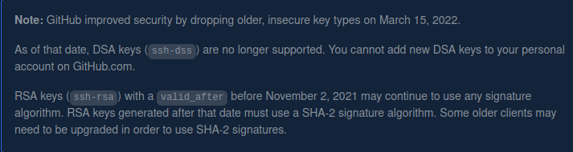

<h3 align="center">
         <p> Generating a new ssh key</p>
</h3>
<hr>
<p>You can generate a new SSH key on your local machine. After you generate the key, you can add the key to your account on GitHub.com to enable authentication for Git operations over SSH.</p>


1. Open Terminal.
2. Paste the text below, substitulting in your GitHub email address.
    ``` $ ssh-keygen -t ed25519 -C "your_email@examole.com"```
    
    Note:If you are using a legacy system that doesn't support the Ed25519 algorithm,use:
    <br>
     ``` $ ssh-keygen -t rsa -b 4096 -C "your_email@example.com" ``` <br>
     This creates a new SSH key,using the provided email as a label.<br>
     ```> Generating public/private ALGORITHM key pair.```<br>
     When you're prompted to "Enter a file in which to save the key", you can press Enter to accept the default file location. Please note that if you created SSH keys previously, ssh-keygen may ask you to rewrite another key, in which case we recommend creating a custom-named SSH key. To do so, type the default file location and replace id_ssh_keyname with your custom key name.<br>
     ```> Enter a file in which to save the key(/home/YOU/.ssh/ALGORITHM):[Press Enter]```<br>
3.At the prompt type a secure passphrase. For more information, see ["Working with SSH key passphrases."](https://docs.github.com/en/authentication/connecting-to-github-with-ssh/working-with-ssh-key-passphrases)<br>
     ``` >Enter passphrase (empty for no passphrase): [Type a passphrase]```<br>
     ``` >Enter same passphrase again: [Type passphrase again]```
     
  
